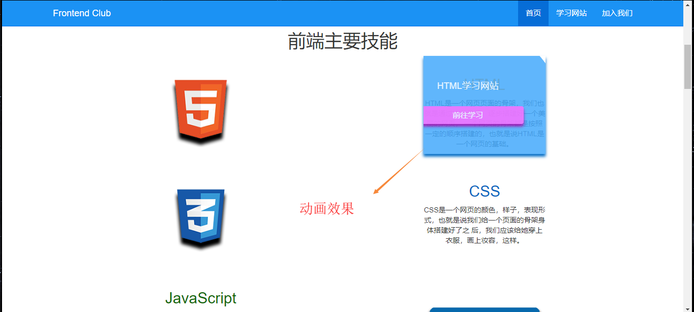
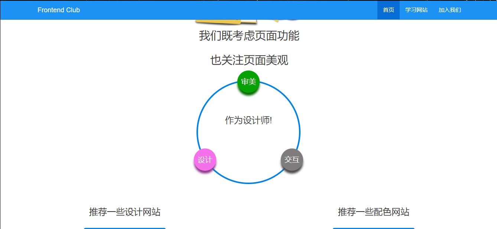
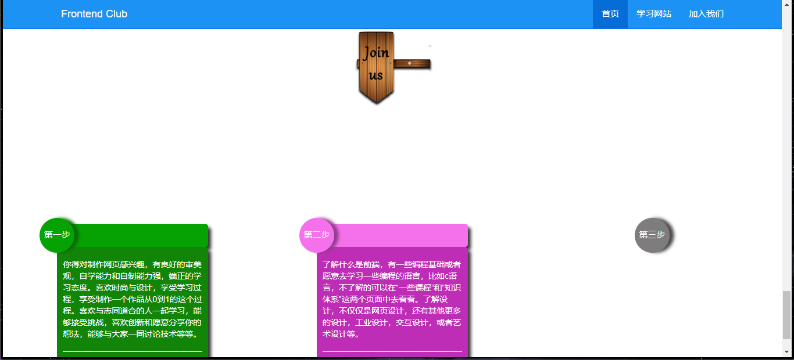
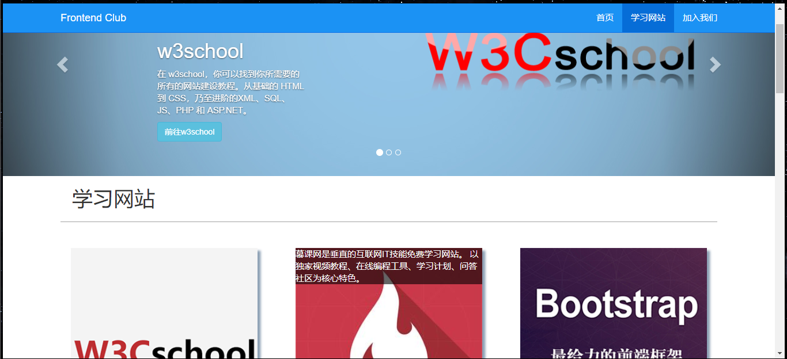
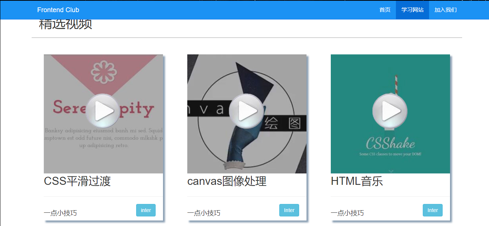
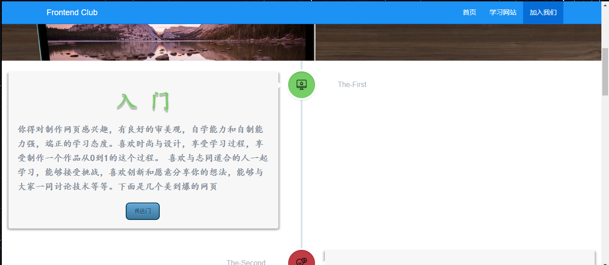
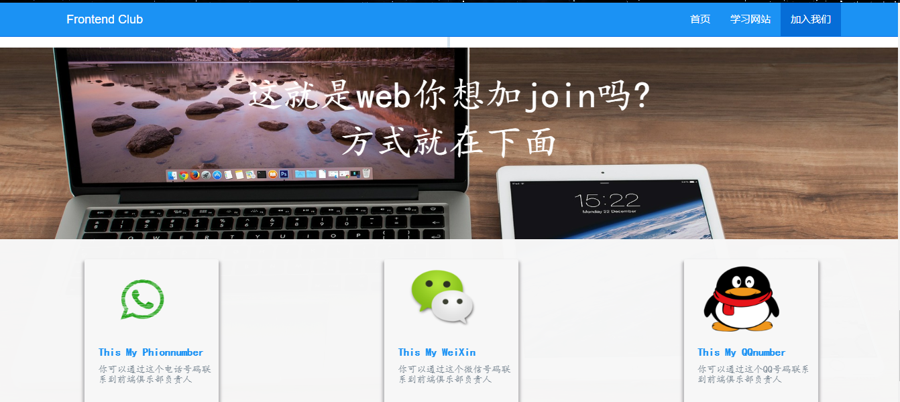

## 项目简介
>
* 项目名：前端俱乐部（前端介绍）
>
* 首页（前端简介）

>
* 学习网站（对我们学习的网站，社区进行分享）

>
* 加入我们（学习流程和一些经验分享，加入方式）

>项目所用技术： Html 搭建页面骨架  
 
> CSS:完成页面样式以及部分动画
 
> jquery、javascript：完成页面布局  动画

> bootstrap :配合css完成响应式布局

> fonts:网络自字体运用

